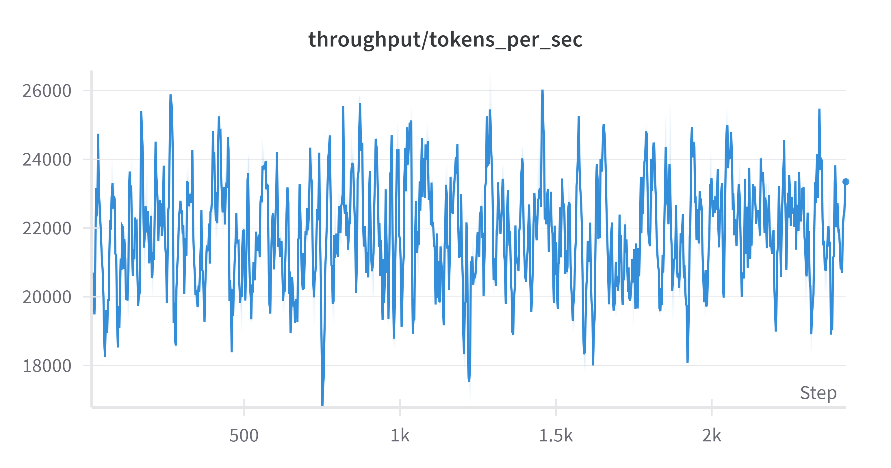
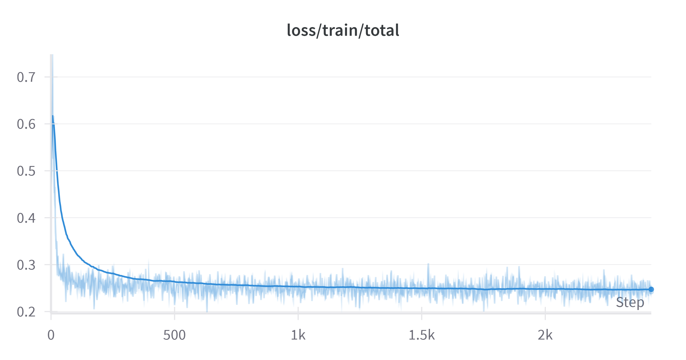

# LLM4Trx-research
<p align="center">
  
</p>

## about
Этот репозиторий посвящён экспериментам с LLM на транзакционных данных

Включает код для моего [диплома](https://drive.google.com/file/d/1YDm5gYVeSLEMmF_wP3rEfPRPy-1fPvyy/view),
а также для экспериментах на открытых данных 
в ходе моей исследовательской работы в Sber AI Lab команде [transactional deep learning](https://github.com/pytorch-lifestream)

in this repo:
* `source/` - source code
  * `llm4trx/` - HF-style multi-gpu llm train
    * `augmentation.py` - код для запуска vllm для генерации аугментаций
    * `pretrain.py` - для next-token-prediction LLM training
    * `inference.py` - multi-gpu llm inference
    * `convert_to_text.py` - конвертер в базовый формат с сохранением jsonl файла (для дальнейшей конвертации в стриминг)
    * `converters.py` - конвертеры в разные форматы
      * `src/`
        * `dataset.py` - всё что связано с обработкой датасета, будь то перевод в текст или создание DataLoader
        * `dataset_hf.py` - весия датасета, используется для тренировки в HF-style и аугментаций
        * `utils.py` - утилиты для получения моделей, эмбеддинга, подсчёта параметров модели и тд
  * `llm-foundry/` - fastest multi-gpu llm train
  * `ptls-experiments/` - data & downstream embeddings validation
* `scripts/` - скрипты для запуска экспериментов и аугментаций
  * `convert_to_text.sh` - переводит массивы транзакций в заданный формат текста, затем переводит текст в Mosaic ML Streaming формат
  * `train.sh.sh` - multi gpu LLM training на задачу next token prediction
  * `model_convertation.sh` - конвертация модели с формата Mosaic ML composer в формат hf transformers
  * `inference.sh` - multi gpu inference
  * `run.sh` - весь пайплайн с заданным seed
  * `run_multi_seed.sh` - весь пайплайн с multi seed
* source/llm4trx
  * `run.sh` - запуск всего пайплайна на основе HF transformers

Три основных конфига (под каждый датасет) лежат в:
`source/llm-foundry/scripts/train/yamls/pretrain`

Конфиги (с версией для HF, сейчас используются для аугментаций) лежат в:
`source/llm4trx/config`

## code
В [llm-foundry](https://github.com/mosaicml/llm-foundry/tree/main) по дефолту используется argparse, так как это не совсем удобно, 
я переписал часть их кода для того
чтобы можно было использовать Hydra и удобно пользоваться конфигами. Также я добавил в их [ConcatTokensDataset](https://github.com/tsebaka/llm-foundry/blob/c70a4847463da8859d7236874ad6705285460f1a/llmfoundry/data/data.py) возможность
обрезать последовательность по max_length, а не просто указывать concat_tokens (потому что библиотека используется
для обучения LLM с нуляи и там просто нет смысла делать обрезку по max_length в режиме pretrain). Это единственное,
что отличает оригинальную библиотеку от моего форка, который используется в этом репозитории.

Немного про различия двух вариантов запуска:
| Параметр  | transaformers | llm-foundry |
|-----------|-----------|-----------|
|augmentations|[vllm](https://github.com/vllm-project/vllm)|[vllm](https://github.com/vllm-project/vllm)|
|dataset |.csv переведённый в hf dataset|.jsonl переведённый в формат [Streaming dataset](https://github.com/mosaicml/streaming)|
| FSDP  | - | + |
| inferece  | multi gpu [accelerate](https://github.com/huggingface/accelerate)  | multi gpu [accelerate](https://github.com/huggingface/accelerate)  |
| model  | hugging face AutoModel  | Mosaic ML composer  |
| скорость (на датасете росбанка)  | 2.5h | 1.3h  |
| удобство в добавлении деталей | максимально гибок | сложно без переписывания библиотеки добавить что-то новое  |
| начальные эксперименты | + | - |

## usage

### с Docker'ом (лучше всего)
image: https://hub.docker.com/orgs/mosaicml/repositories.
<!--pytest.mark.skip-->
```bash
git clone https://github.com/mosaicml/llm-foundry.git
cd llm-foundry
pip install -e ".[gpu]"
```

### настройка окружения (без Docker'а)
```sh
git clone https://github.com/tsebaka/LLM4Trx-research.git
cd LLM4Trx-research
cd source

# prep ptls-experiments
cd ptls-experiments
python3 -m venv ptls-venv
source ptls-venv/bin/activate
pip install pytorch-lifestream
cd ..

# prep llm-foundry
cd llm-foundry
python3 -m venv llmfoundry-venv
source llmfoundry-venv/bin/activate
pip install cmake packaging torch
pip install -e ".[gpu]"
pip install deepspeed=0.15.4
cd ..
```

### llm-foundry training
```sh

WORK_DIR=$HOME/zoloev-city/exp_name
CONFIG_DIR=$WORK_DIR/source/llm-foundry/scripts/train/yamls/pretrain

source $WORK_DIR/source/llm-foundry/llmfoundry-venv/bin/activate

export WANDB_API_KEY=2736e3a99574e3049342cd33a3154aa307a08aa1
export WANDB_PROJECT="llm4trx"
export WANDB_DIR=$WORK_DIR/checkpoints


CONFIG=config_name
echo "========== starting... $CONFIG =========="

echo "========== convert to text... =========="
python $WORK_DIR/source/llm4trx/convert_to_text.py \
    --config-dir $CONFIG_DIR \
    --config-name $CONFIG \
    variables.work_dir=$WORK_DIR

echo "========== convert to streaming... =========="
python $WORK_DIR/source/llm-foundry/scripts/data_prep/convert_dataset_json.py \
    --config-dir $CONFIG_DIR \
    --config-name $CONFIG \
    variables.work_dir=$WORK_DIR

echo "========== training llm foundry... =========="
composer $WORK_DIR/source/llm-foundry/scripts/train/train.py \
    $CONFIG_DIR/$CONFIG \
    variables.work_dir=$WORK_DIR

echo "========== convert model to hf... =========="
python $WORK_DIR/source/llm-foundry/scripts/inference/convert_composer_to_hf.py \
    --config-dir $CONFIG_DIR \
    --config-name $CONFIG \
    variables.work_dir=$WORK_DIR

echo "========== inference... =========="
accelerate launch $WORK_DIR/source/llm4trx/inference.py \
    --config-dir $CONFIG_DIR \
    --config-name $CONFIG \
    variables.work_dir=$WORK_DIR
echo "========== completed! =========="
```

### hf-style training & augmentations
```sh
eval "$(conda shell.bash hook)"

export CUDA_VISIBLE_DEVICES=0,1,2,3
export WANDB_PROJECT="llm4trx"

exp_name=config_name
log_dir=.../${exp_name}
checkpoint="checkpoint-id"
config_name="${exp_name}.yaml"

export WANDB_DIR=$log_dir

source llmfoundry-venv/bin/activate # для hf-style придётся доставить transformers нужной версии

# llm text augmentations
python -m dataset_preparing \
    --config-dir config \
    --config-name ${config_name} \
    ++exp_name=${exp_name} \
    ++log_dir=${log_dir} \
    ++dataset.presave=false

# ntp train
accelerate launch sft_train.py \
    --config-dir config \
    --config-name ${config_name} \
    ++exp_name=${exp_name} \
    ++log_dir=${log_dir} \
    ++dataset.presave=false

# inference
checkpoint="checkpoint-X"
accelerate launch inference.py \
    --config-dir config \
    --config-name ${config_name} \
    ++exp_name=${exp_name} \
    ++log_dir=${log_dir} \
    ++checkpoint=${checkpoint} \
    ++dataset.presave=false

# downstream validation
conda activate kaggle_kernel
cd .../ptls-experiments/scenario_rosbank
rm -r embeddings_validation.work/

pipenv run python -m embeddings_validation \
    --config-dir conf \
    --config-name embeddings_validation_baselines_unsupervised \
    +workers=10 \
    +total_cpu_count=20 \
    ++report_file=".../checkpoints-logs/${exp_name}/experiment_name.txt"
conda deactivate
```

## Hardware
В моём распоряжении было:

- 8x NVIDIA A100 GPUs (80 GB HBM2e per GPU)
- 1 TB of DDR4 RAM

## Results

### Throughput
<p align="center">
  
</p>

### Loss
<p align="center">
  
</p>

### Metrics
<p align="center">
  
</p>
